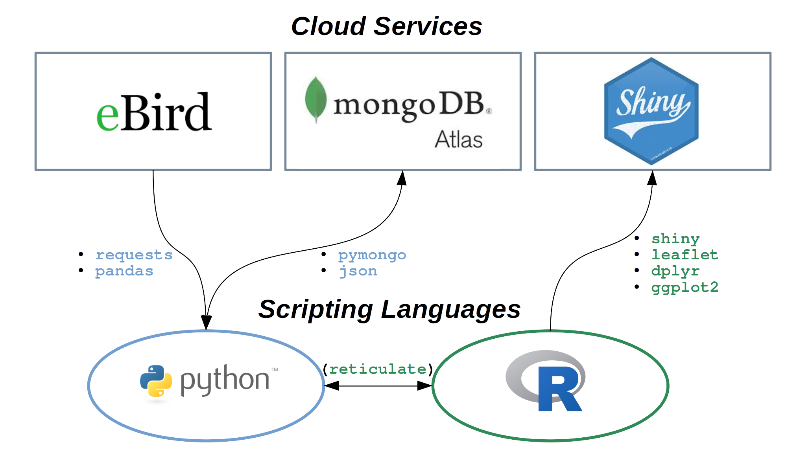
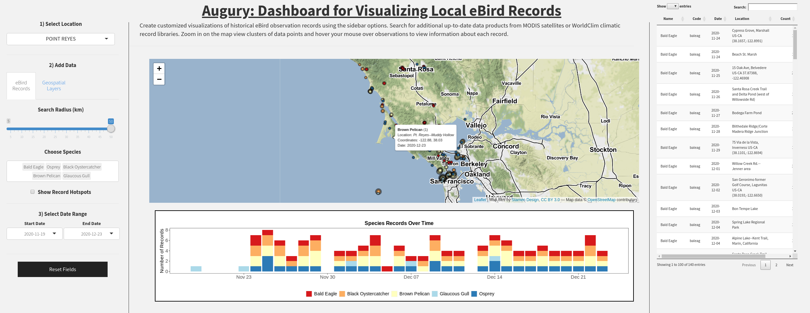
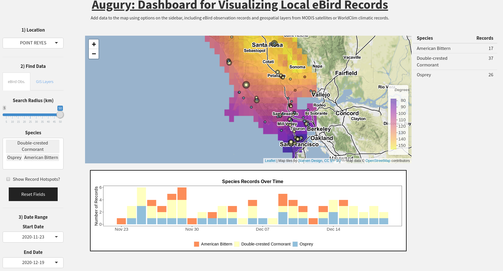

As a birdwatcher and data enthusiast, I was excited to learn that [eBird](https://ebird.org/) offers access to numerous data products via an API service, which I hoped to use to keep tabs on some of the trends in bird activity (species composition, local hotspots, etc.) in my area. However, I was a little dismayed to find that their API only allows access to data going back, at most, 30 days from the present. Therefore, I decided to create a program of my own that can store observation records in a remote database so that they might be queried later in order to create maps and visualize historical trends in the data.

I call this application **Augury**, named for the ancient Roman practice of divination based on observations of birds. The program downloads local eBird records each day and then uploads them, after some slight modifications, to a remote MongoDB database hosted by MongoDB's Atlas service. This allows the collection of records to grow over time, beyond the original 30-day limit, so that I may query and visualize long-term trends in the data. The resulting maps and visualizations are performed using a web-based Shiny app, hosted on [shinyapps.io](https://www.shinyapps.io).

Most of the back-end actvity (eBird API requests, MongoDB database management, and database queries) is handled using Python scripts, while R code is used for final data manipulations and plotting as well as to create the interactive front-end using `shiny`. The `reticulate` package for R facilitates the nearly seamless exchange of data objects and functions across the two programming languages.

## **Updates**

A number of changes have been made to improve user experience as well as add functionality for selecting geospatial data layers to overlay on the map. The program is now almost entirely reactive to changes in user inputs such that the interface will automatically update when new menu selections are made. This includes selecting ancillary GIS layers to cover the base (terrain) map, including data either from near-realtime MODIS satellite images (courtesy of the `MODISTools` package from [rOpenSci](https://ropensci.org/)) or long-term climatic variables from [WorldClim](https://worldclim.org/).

Smaller code edits were made to the underlying Python code that handles data exchange between the front-end and MongoDB servers, mostly to do with handling connection errors and changes to how client/collection variables are shared within an object. 

I am still finalizing the design and suite of features for the user interface, but have decided to upload the code for the current, functional (read: alpha) version of the program. Most of the back-end is up and running with few anticipated changes to be added later. All that is needed to get started is an eBird account and API access key. I leave the choice of MongoDB database configuration to you, but highly recommend the MongoDB's Atlas cluster service, which offers a free tier that is more than adequate for handling these tasks.

**Check back soon for additional updates and details for creating your own database and visualization dashboard! Some features I hope to implement in the near-future include**:

* A nested/collapsable data frame organized by species (in place of the simple table in the top right of the interface) for exploring individual observation records. JavaScript is not my strong suit, but this feature will be a great opportunity to learn from.
* A picture of each bird species embedded within the hover tooltip.
