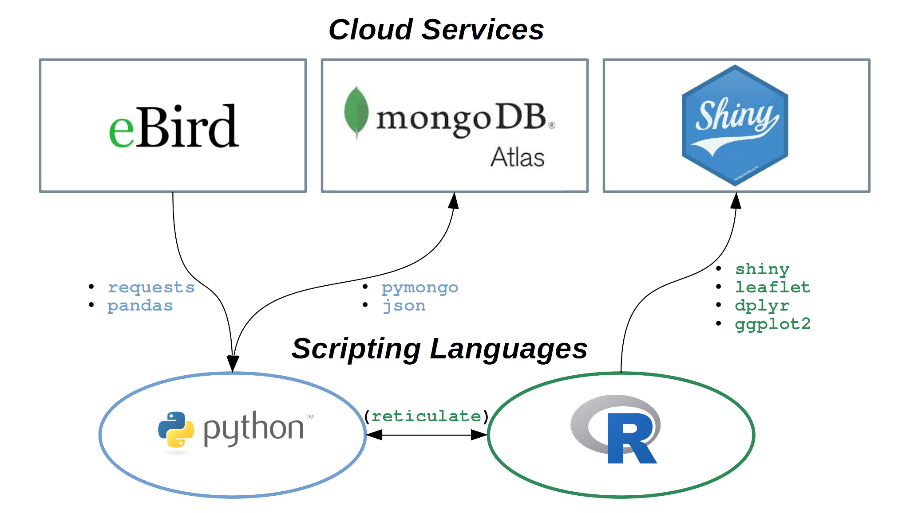

Augury: Dashboard for Cataloguing & Visualizing Local eBird Records
================



As a birdwatcher and data enthusiast, I was excited to learn that
[eBird](https://ebird.org/) offers access to numerous data products via
an API service, which I hoped to use to keep tabs on some of the trends
in bird activity (species composition, local hotspots, etc.) in my area.
However, I was a little dismayed to find that their API only allows
access to data going back, at most, 30 days from the present. Therefore,
I decided to create a program of my own that can store observation
records in a remote database so that they might be queried later in
order to create maps and visualize historical trends in the data.

I call this application **Augury**, named for the ancient Roman practice
of divination based on observations of birds. The program downloads
local eBird records each day and then uploads them, after some slight
modifications, to a remote MongoDB database hosted by MongoDB’s Atlas
service. This allows the collection of records to grow over time, beyond
the original 30-day limit, so that I may query and visualize long-term
trends in the data. The resulting maps and visualizations are performed
using a web-based Shiny app, hosted on
[shinyapps.io](https://www.shinyapps.io).

Most of the back-end actvity (eBird API requests, MongoDB database
management, and database queries) is handled using Python scripts, while
R code is used for final data manipulations and plotting as well as to
create the interactive front-end using `shiny`. The `reticulate` package
for R facilitates the nearly seamless exchange of data objects and
functions across the two programming languages.

## **Features**

### Search for records by species, location, and date range

Create customized visualizations of historical eBird observation records
using the sidebar options. Zoom in on the map view clusters of data
points and hover your mouse over observations to view detailed
information about each record.


### Find local birding hotspots

In addition to searching for specific records, users can also select the
*Record Hotspots* feature to examine how the spatial distribution of
eBird records varies across their region. A kernel density funtion is
first estimated from *all* of the records in the region, and the results
are then overlaid onto the terrain map. With this information, it is
easy to locate the most popular birding spots in the area.


### Geospatial data layers

Also included is the ability to select ancillary GIS layers to cover the
base (terrain) map, including past and recent data from either MODIS
satellite images (courtesy of the `MODISTools` package from
[rOpenSci](https://ropensci.org/)) or long-term climatic variables from
the [WorldClim](https://worldclim.org/) project data set.


In the above example, eBird observation records are contrasted with
landcover classification data from the MODIS MCD12Q1 data product.

## Installation

Along with the code in this repository, you will need an eBird account
and API access key to get up and running. I leave the choice of MongoDB
database configuration to you, but highly recommend the [MongoDB
Atlas](https://www.mongodb.com/cloud/atlas/register) service, which
offers a free tier that is more than adequate for handling these tasks.

### Automatically update the remote database with new records

While running, the app will periodically search for and add new eBird
records (every 4 hours by default). To change how often this is done,
edit the following block from the `app.R` file (towards the end):

``` r
## Periodically update the MongoDB database with new records
timelapse <- 1000*60*4 # 4 hours in milliseconds
update_records <- reactivePoll(
  timelapse,
  session,
  # This function returns the time that log_file was last modified
  checkFunc = function() {
    Sys.time()
  },
  # This function returns the content of log_file
  valueFunc = function() {
    # Run database update script
    reticulate::py_run_file("Python/update_database.py")
  }
)
```

The Python update script `update_database.py` (contained in the
`Python/` directory of this repository) can also be run separately at
any time from a terminal window or console:

    python3 Python/update_database.py

## **Updates**

A number of changes have been made to improve user experience as well as
add functionality for selecting geospatial data layers to overlay on the
map. The program is now almost entirely reactive to changes in user
inputs such that the interface will automatically update when new menu
selections are made.

Smaller code edits were made to the underlying Python code that handles
data exchange between the front-end and MongoDB servers, mostly to do
with handling connection errors and changes to how client/collection
variables are shared within an object.

**Check back soon for additional updates and details for creating your
own database and visualization dashboard\! Some features I hope to
implement in the near-future include**:

  - A nested/collapsable data frame for reviewing the individual records
    returned by a search, organized by species (in place of the simple
    table on the right of the interface). JavaScript is not my strong
    suit, but this feature will be a great opportunity to learn from.
  - A picture of each bird species embedded within the hover tooltip.
